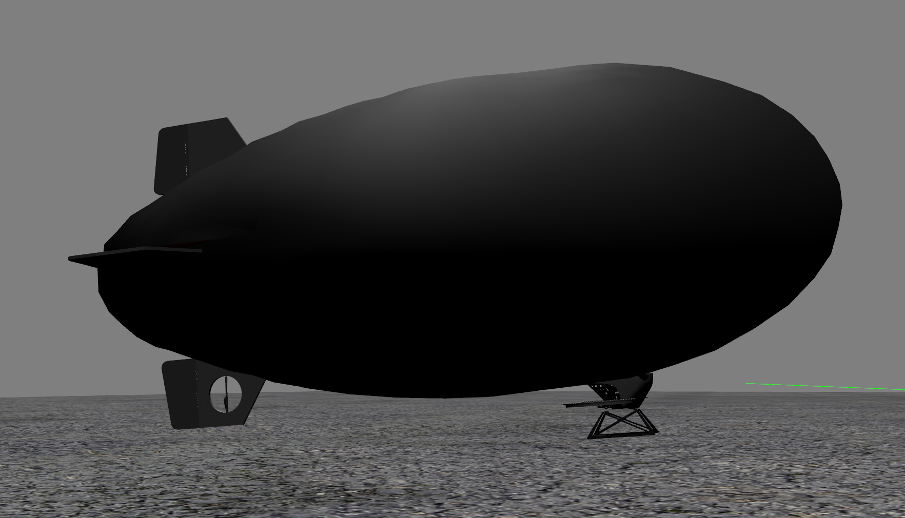

Deformable Airship Simulation in ROS/Gazebo
=================================================================

## For more information, read our preprint on Arxiv: https://arxiv.org/abs/2012.15684
--------------------------------------------------------------

# Copyright and License

All Code in this repository - unless otherwise stated in local license or code headers is

Copyright 2020 Max Planck Institute for Intelligent Systems

Licensed under the terms of the GNU General Public Licence (GPL) v3 or higher.
See: https://www.gnu.org/licenses/gpl-3.0.en.html


# Contents
ROS packages:

* /blimp_description -- including blimp xml files that described the robot and supports Gazebo/ROS styled simulation. 
* /blimp_gazebo_plugin -- some gazebo plugins

# Compiling
Link or copy the packaged into the *src* folder of your catkin workspace.

Build packages with **catkin_make**

# Requirements
* [ROS] (http://wiki.ros.org/melodic) 
* [mav_msgs] (http://wiki.ros.org/mav_msgs)
* [Gazebo] (http://gazebosim.org/) -- tested with Gazebo 9.0


Installation Instructions - Ubuntu 20.04 with ROS Noetic and Gazebo 11
---------------------------------------------------------------------------

1. Install and initialize ROS Noetic desktop full, additional ROS packages, catkin-tools, and wstool:

```console
$ sudo sh -c 'echo "deb http://packages.ros.org/ros/ubuntu $(lsb_release -sc) main" > /etc/apt/sources.list.d/ros-latest.list'
$ sudo apt-key adv --keyserver 'hkp://keyserver.ubuntu.com:80' --recv-key C1CF6E31E6BADE8868B172B4F42ED6FBAB17C654
$ sudo apt update
$ sudo apt install ros-noetic-desktop-full ros-noetic-joy ros-noetic-octomap-ros ros-noetic-mavlink
$ sudo apt install python-wstool python-catkin-tools protobuf-compiler libgoogle-glog-dev ros-noetic-control-toolbox
$ sudo rosdep init
$ rosdep update
$ echo "source /opt/ros/noetic/setup.bash" >> ~/.bashrc
$ source ~/.bashrc
$ sudo apt install build-essential
```
2. If you don't have ROS workspace yet you can do so by

```console
$ mkdir -p ~/catkin_ws/src
$ cd ~/catkin_ws/src
$ catkin_init_workspace  # initialize your catkin workspace
$ git clone --recurse-submodules https://github.com/robot-perception-group/airship_simulation.git -b noetic
```

3. Build your workspace with `python_catkin_tools` 

```console
$ cd ~/catkin_ws
$ rosdep install --from-paths src -i
$ catkin_make
$ source devel/setup.bash
```

4. Add sourcing to your `.bashrc` file

```console
$ echo "source ~/catkin_ws/devel/setup.bash" >> ~/.bashrc
$ source ~/.bashrc
```

5. To build the LibrePilot Submodule, go into the LibrePilot subfolder

```console
$ cd src/airship_simulation/LibrePilot
$ # install qt sdk for building of GCS
$ make qt_sdk_install
$ # install arm sdk for building of flightcontroller firmware
$ make arm_sdk_install
$ # install uncrustify
$ make uncrustify_install
$ # install build dependencies
$ sudo apt install libusb-dev libsdl-dev libudev-dev libosgearth-dev libopenscenegraph-3.4-dev gcc-7 g++-7
$ # IMPORTANT # Ubuntu20 uses gcc-9 by default, but gcs does not compile with gcc9 due to some new warnings treated as errors
$ # build gcs - ENFORCE gcc-7
$ GCS_QMAKE_OPTS="QMAKE_CXX=g++-7 QMAKE_CC=gcc-7" make -j 10 gcs
$ # if this fails, check error message for possible additional dependencies
$ # build SITL flightcontroller executable
$ make -j 10 fw_simposix
$ # build HITL flightcontroller firmware
$ make -j 10 fw_revolution
```

Note:If make fw_revolution fails with "Command not Found" it's likely that the ARM crosscompiler, which is a 32bit binary, cannot be executed.
In this case follow the instructions here: https://askubuntu.com/questions/454253/how-to-run-32-bit-app-in-ubuntu-64-bit
If you are not planning to use a hardware flightcontroller you can skip this step.

Basic Usage
----------------------------------------------------------
After installing, you can test with the following commands in a terminal

```console
$ roslaunch blimp_description blimp_gcs.launch
$ # or
$ roslaunch blimp_description blimp_gcs_wind.launch
```

To fly with blimp, it is necessary to run a flight controller (physical, plugged in via USB, or virtual, running simposix) and the GCS to run the HITL interface.

SITL:
```console
$ cd ~/catkin_ws/src/airship_simulation/LibrePilot
$ # note the 0 at the end - this is an index, required if multiple instances need to run simultaneously
$ ./build/firmware/fw_simposix/fw_simposix.elf 0

```

note that the SITL firmware will load and store settings from files
in the current working directory, in this case
~/catkin\_ws/src/airship\_simulation/LibrePilot
These files have the format ABCDEF123.o00 where ABCDEF123 is the CRC32
of the settings object in question.

The default/factory configuration is not suitable for airships, but
a configuration has been provided in experiments/SITL.uav
This can be loaded through the GCS after connecting to the flight controller, see below.

GCS:
```console
$ cd ~/catkin_ws/src/airship_simulation/LibrePilot
$ ./build/librepilot-gcs_release/bin/librepilot-gcs
```
Required Configuration of GCS:
1. Go to Tools -> Options -> IP Network Telemetry
   set "Host Name/Number" to "localhost" Port "9000"
   set UDP connection
2. Go to Tools -> Options -> OPMap -> Google Sat
   set Map type to "OpenStreetMap"
   (google sat API is no longer functional in this version)
3. Select the "HITL" tab (bottom), then
   Select Window -> Edit Gadgets Mode
   In the HITL Simulation gadget, schange type from XPlane9 HITL
   to ROS HITL
4. In the "HITL" tab,
   Select Window -> Edit Gadgets Mode
   Change the bottom center gadget from "Magic Waypoint" to "System Health"
5. Familiarize yourself with the GCS. It is highly configurable. You can split the screen to add more gadgets, such as the map, UAVObject Browser or scopes and dials. You can also add more tabs.
6. Save the GCS settings with File -> Save GCS Default Settings to make your changes permanent. You can revert all changes by deleting the folder ~/.config/LibrePilot
   
Load a valid airship configuration into the flight controller:
1. Start the SITL flight controller with
   $ ./build/firmware/fw_simposix/fw_simposix.elf 0  
2. Select Connections (bottom right) -> UDP: localhost
3. Click Connect
4. Select File->Import UAV Settings
5. Select experiments/SITL.uav in the root folder of this repository
6. Make sure all objects are selected, then click "Save to Board Flash"
7. Click Disconnect (bottom right)
8. Stop the flight controller with CTRL+C - Some settings will only be applied after the next restart!

Starting a simulation:
1. Start the SITL flight controller with
   $ ./build/firmware/fw_simposix/fw_simposix.elf 0  
2. Select Connections (bottom right) -> UDP: localhost
3. Click Connect
4. Start Gazebo if you haven't yet with
   roslaunch blimp\_description blimp\_gcs\_wind.launch
5. Click "Start" in the HITL gadget
   the attitude from simulator should now show up in the artificial horizon
   both  Autopilot ON and ROS connected should be green
6. In the "Controller" widget
   click "GCS control", as well as "Arm switch (Accessory 0)"
7. You should now be able to control the blimp. Engage autonomous modes with the "Flight Mode" switch:
   1. Mode 1 is Manual control through the GCS control gadget. Thruttle and rudder is on the left, thrust vector and pitch on the right.
   2. Mode 2 is Stabilized control, with setpoints given through GCS control gadget.
   3. Mode 3 is PositionHold - the guidance algorithm will loiter around the current position and altitude as close as it can.
   4. Mode 4 engages the PathPlanner and will follow a previously uploaded waypoint sequence.
   
Example Video:

[](http://www.youtube.com/watch?v=LNybtK3HNp8)

Loading Waypoints:
1. Make a Telemetry connection to a flight controller in the GCS
2. In the "Flight data" tab , right click on the map, select "waypoint editor"
3. In the dialog, click the "Read from file" icon. (Cardboard box with an arrow)
4. Select experiments/waypoints.xml in the root folder of this repository
5. Click the Green up arrow to send the path plan to the flight controller

Note: The path plan is not kept between reboots/restarts of the flight controller and needs to be re-uploaded for every new flight.
The pathplan can be executed in the "PathPlanner" flight mode - position 4 on the flight mode switch in GCS Control gadget

## Reproduction of results:
--------------------------

--------------
# Experiment 1
--------------

  1. Load simulation with:
```console
$ roslaunch blimp_description blimp_gcs_wind.launch
```
  2. Fly the blimp manually
     * Start GCS and SITL Flight Controller, Connect to Flight Controller
     * Engage HITL Gadget in GCS
     * Leave Flight Mode Switch in "1" (Manual Flight) or "2" (Stabilized Flight)
  3. If desired, change URDF condiguration
     * Edit blimp_desciption/urdf/\*.xacro , then re-run simulation with modified/different airship model

--------------
# Experiment 2
--------------

  1. Load simulation with:
```console
$ roslaunch blimp_description blimp_gcs.launch
```
  2. Engage position hold
     * Start GCS and SITL Flight Controller, Connect to Flight Controller
     * Engage HITL Gadget in GCS
     * Put Flight Mode Switch to "3" (Position Hold)
  3. Start Flight Controller ROS integration to expose additional data topics
```console
$ rosrun librepilot librepilot_node /blimp UDP 127.0.0.1 9002
```
  4. Record data with "rosbag record" if desired.

--------------
# Experiment 3
--------------

  1. Load simulation with:
```console
$ roslaunch blimp_description blimp_gcs.launch
```
  2. Engage position hold
     * Start GCS and SITL Flight Controller, Connect to Flight Controller
     * Start waypoint editor in maps gadget and load waypoints.xml file from experiments subfolder
     * Upload waypoints to Flight Controller
     * Engage HITL Gadget in GCS
     * Put Flight Mode Switch to "4" (Path Plan)
  3. Start Flight Controller ROS integration to expose additional data topics
```console
$ rosrun librepilot librepilot_node /blimp UDP 127.0.0.1 9002
```
  4. Record data with "rosbag record" if desired.

--------------
# Experiment 4
--------------

  1. Load simulation with:
```console
$ roslaunch blimp_description blimp_gcs_wind.launch
```
  2. Proceed as with Experiment 2 and 3
 
--------------
# Experiment 5
--------------

  1. Load simulation with:
```console
$ roslaunch blimp_description blimp_gcs.launch
```
  2. Proceed as with Experiment 2 or 3
  3. During experiment, execute:
```console
$ ./deflate_blimp.sh 8 0 0.2 .95
```
  
--------------
